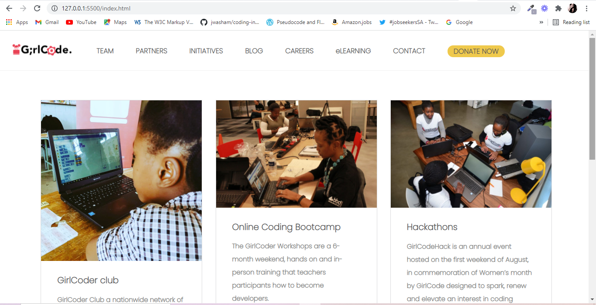
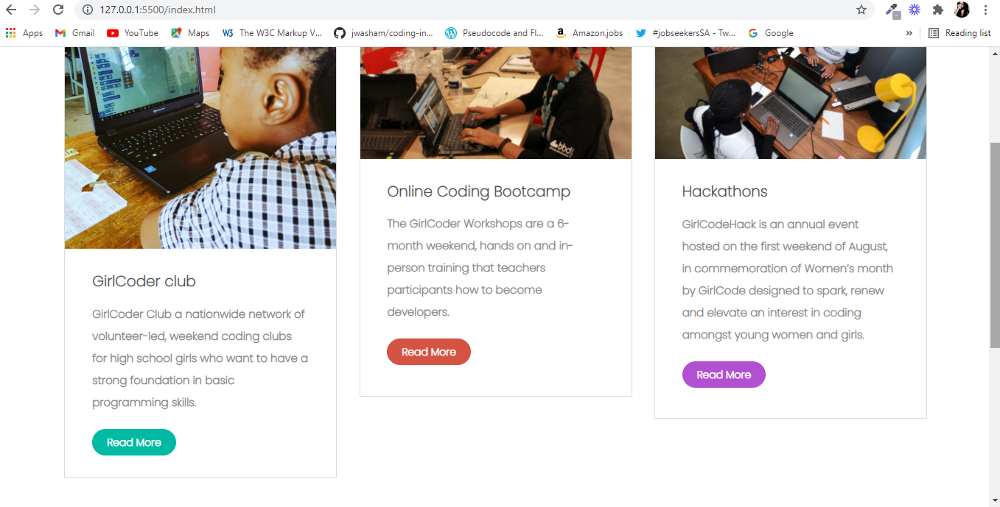
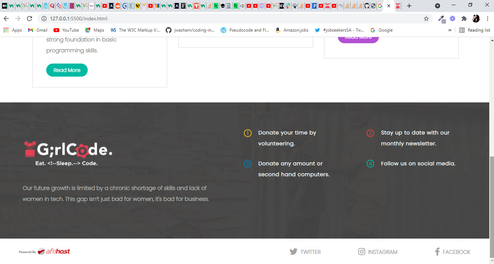
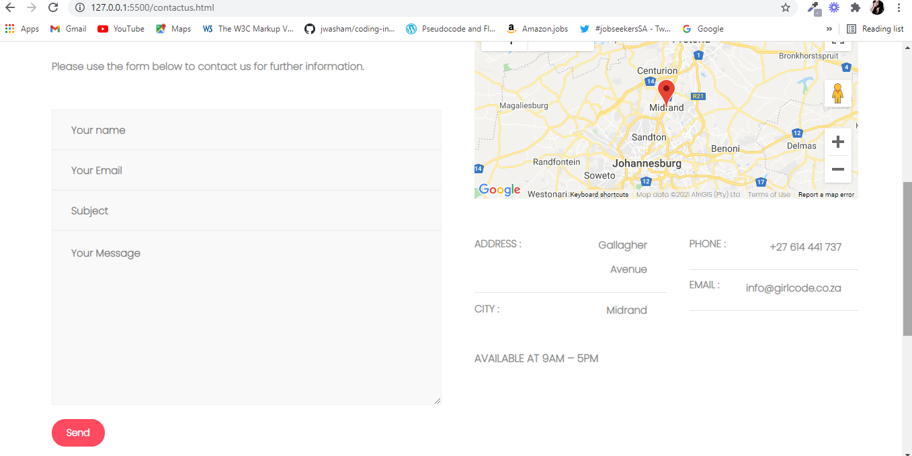
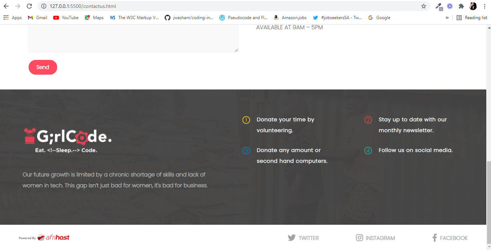

# DOM-Manipulation-Website

Manipulating the DOM using ONLY JavaScript to create a website.

# Built With

- HTML5
- CSS3
- Javascript
- ES6

# Description

A clone of both the Initiatives, and Contact pages of the GirlCode za website. This project uses DOM manipulation to manipulate HTML elements in JavaScript, and demonstrates an understanding of JavaScript fundamentals such as ES6 concepts, as well as Modules. These web pages were created using ONLY Javascript and a few lines of HTML.

# Screenshots

|                     Initiatives page                     |                     Initiatives page                     |
| :------------------------------------------------------: | :------------------------------------------------------: |
|  |  |

|                     Initiatives page                     |                   Contact page                   |
| :------------------------------------------------------: | :----------------------------------------------: |
|  |  |

|                   Contact page                   |                   Contact page                   |
| :----------------------------------------------: | :----------------------------------------------: |
|  |  |

## [Live Demo Link](https://raw.githack.com/BongekileM/DOM-Manipulation-Website/main/index.html)

# Prerequisites

- Code Editor of your choice.
- A local web server of your choice.
- One currently popular local web server you can install is live-server.

# Usage

- Clone this repository to your desktop.
- Open the index.html file in your browser through a local web server of choice.

# :handshake: Contributions

Contributions are welcome. To make a contribution:

- Open an issue.
- Fork and clone this repository.
- Send a pull request.

# Authors

- [Bongekile Mncube](https://github.com/BongekileM)
